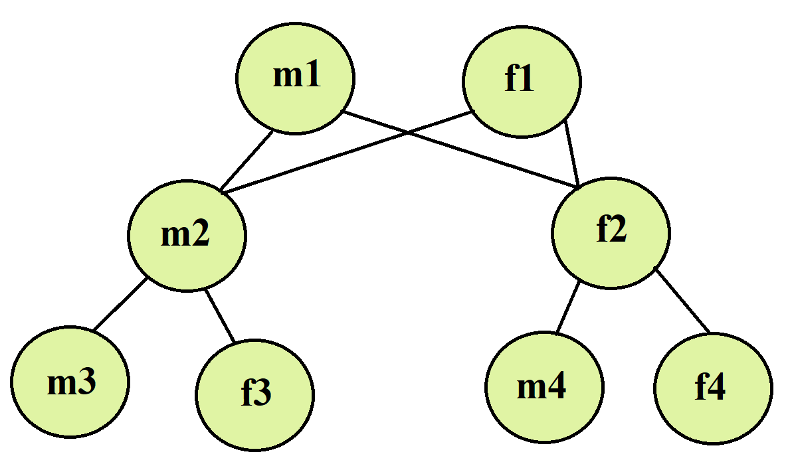
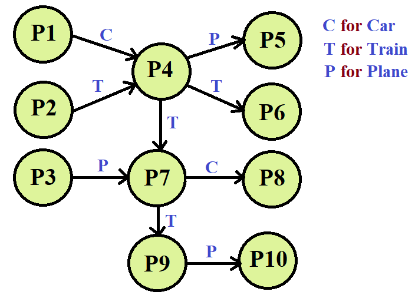

# Family Relationships Representation Tree

# ScientificCalculator Operations
* Adding
* Subtracting
* Multiplying
* Dividing
* powering
* GCD
* LCM
* Sum of the list
* Size of the list

# Planning a Travel Journey world
 

